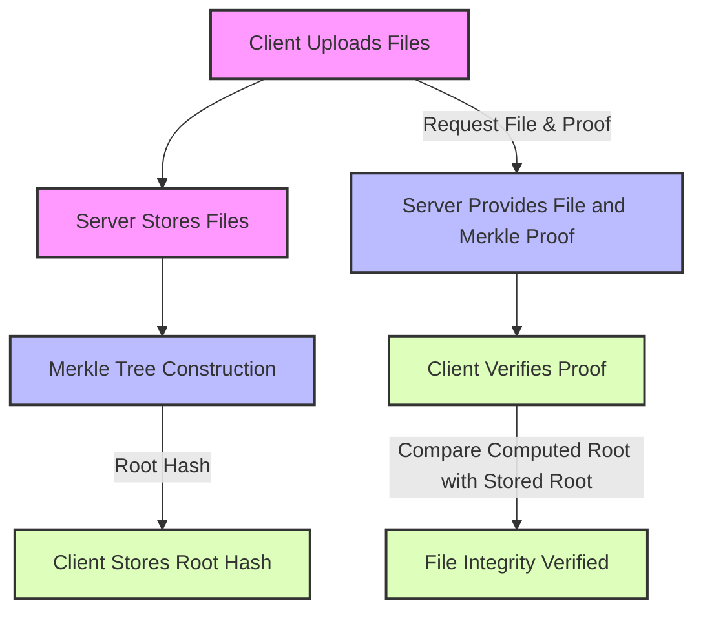

# Report on Merkle Safe File

## Overview

Merkle Safe File comprises a client application, a server, and a Merkle tree structure to ensure the integrity and verification of files uploaded to the server. The client application allows users to upload files, which are then stored on the server. The Merkle tree is utilized to generate a root hash that aids in verifying the integrity of the files upon retrieval.

Instructions on how to run the application can be found in the `README.md` file.

The demonstration of the application uses 4 files `file1.txt`, `file2.txt`, `file3.txt` and `file4.txt` to demonstrate the upload and verification process, but can be extended to any number of files.

**IMPLEMENTATION DETAILS**

**Client Application (`client/client.py`):**

* The client application provides functionalities to upload files to the server and verify their integrity upon retrieval.   
* It utilizes the requests library for HTTP communication with the server.  
* Files are hashed using SHA-256 before uploading, and a Merkle tree is constructed from these hashes to obtain a single root hash.
* The root hash is stored locally by the client for future verification of file integrity.
* Upon file retrieval, the client requests a Merkle proof from the server and verifies the integrity by comparing the computed root hash with the stored one.

**Server Application (`server/server.py`):**
* The server is built using the Flask framework, handling file uploads and serving file requests along with their Merkle proofs.
* Files are stored in a predefined directory, and their hashes are added to a global Merkle tree.
* Upon a file request, the server retrieves the file, calculates its hash, generates a Merkle proof, and sends these back to the client.

**Merkle Tree (`common/merkle.py`):**
* A custom implementation of the Merkle tree is used to manage the hashes of files.
* The Merkle tree allows for efficient and secure verification of file contents by generating proofs for individual files.
* The verification process involves recalculating the Merkle root using the provided proof and comparing it with the stored root hash.

**Diagram of the Process:**


## Potential Improvements

**Security Enhancements:**

Implement SSL/TLS for secure communication between the client and server to protect file data and verification information in transit.

Add authentication and authorization mechanisms to ensure that only authorized users can upload or request files and proofs.

**Performance Optimization:**

Introduce concurrency or parallel processing for handling file uploads and Merkle tree operations to improve system throughput.

Optimize the storage and retrieval of files and Merkle proofs, possibly by caching frequently accessed items.

**Scalability Considerations:**

Consider using a distributed file storage system to handle scalability issues with an increasing number of files.

Adapt the Merkle tree implementation to support dynamic scaling and rebalancing as the number of files grows.

**Usability Improvements:**

Develop a more user-friendly client interface, potentially with a graphical user interface (GUI), to simplify the process of uploading and verifying files.

Provide detailed logs and error messages to help users and administrators troubleshoot issues.

**Docker**

This version contains the necesary `Dockerfile` and `docker-compose.yml` to run the application in a containerized environment.  However this currently deployed for testing purposes and proof of concept. For a production scenario you would separate the server from the client as normally they would be in different systems. Also the client inmediatly exits because its not instructed to do anything.

```
docker-compose up --build                                                                                                      INT ✘  11:11:16 
[+] Building 1.0s (18/18) FINISHED                                                                                                                                                
 => [server internal] load build definition from Dockerfile                                                                                                                  0.0s
 => => transferring dockerfile: 891B                                                                                                                                         0.0s
 => [client internal] load metadata for docker.io/library/python:3.12-bullseye                                                                                               0.6s
 => [server internal] load .dockerignore                                                                                                                                     0.0s
 => => transferring context: 2B                                                                                                                                              0.0s
 => [client 1/5] FROM docker.io/library/python:3.12-bullseye@sha256:1fcf0936c24ca5dc1bd08be8bb55fe4ae8e69575112e2e361d81007b6f238c00                                         0.0s
 => [server internal] load build context                                                                                                                                     0.0s
 => => transferring context: 3.41kB                                                                                                                                          0.0s
 => CACHED [client 2/5] WORKDIR /app                                                                                                                                         0.0s
 => CACHED [server 3/6] COPY ./server/server.py /app/server/                                                                                                                 0.0s
 => CACHED [server 4/6] COPY ./common /app/common                                                                                                                            0.0s
 => CACHED [server 5/6] RUN pip install Flask                                                                                                                                0.0s
 => CACHED [server 6/6] RUN mkdir /app/server/server_uploaded_files                                                                                                          0.0s
 => [server] exporting to image                                                                                                                                              0.0s
 => => exporting layers                                                                                                                                                      0.0s
 => => writing image sha256:7eac295f6a8938115a11ab734652b7d7975a8e7d58b655fe40e844a4fd98ed63                                                                                 0.0s
 => => naming to docker.io/library/parischallenge-server                                                                                                                     0.0s
 => [client internal] load build definition from Dockerfile                                                                                                                  0.0s
 => => transferring dockerfile: 654B                                                                                                                                         0.0s
 => [client internal] load .dockerignore                                                                                                                                     0.0s
 => => transferring context: 2B                                                                                                                                              0.0s
 => [client internal] load build context                                                                                                                                     0.0s
 => => transferring context: 4.68kB                                                                                                                                          0.0s
 => CACHED [client 3/5] COPY ./client/client.py /app/client/                                                                                                                 0.0s
 => CACHED [client 4/5] COPY ./common /app/common                                                                                                                            0.0s
 => CACHED [client 5/5] RUN pip install requests                                                                                                                             0.0s
 => [client] exporting to image                                                                                                                                              0.0s
 => => exporting layers                                                                                                                                                      0.0s
 => => writing image sha256:20d08891ee9efefeaf53ed43f97c5f81c6e21955528f10305f60d64822053916                                                                                 0.0s
 => => naming to docker.io/library/parischallenge-client                                                                                                                     0.0s
[+] Running 2/2
 ✔ Container parischallenge-server-1  Recreated                                                                                                                              0.1s 
 ✔ Container parischallenge-client-1  Recreated                                                                                                                              0.1s 
Attaching to parischallenge-client-1, parischallenge-server-1
parischallenge-server-1  |  * Serving Flask app 'server'
parischallenge-server-1  |  * Debug mode: on
parischallenge-server-1  | INFO:werkzeug:WARNING: This is a development server. Do not use it in a production deployment. Use a production WSGI server instead.
parischallenge-server-1  |  * Running on http://127.0.0.1:5000
parischallenge-server-1  | INFO:werkzeug:Press CTRL+C to quit
parischallenge-server-1  | INFO:werkzeug: * Restarting with stat
parischallenge-server-1  | WARNING:werkzeug: * Debugger is active!
parischallenge-server-1  | INFO:werkzeug: * Debugger PIN: 821-778-825
parischallenge-client-1 exited with code 0

```

## Challenges Encountered

Time:

For this solution to be production ready, it requires more than a few hours of development and testing. With enough time all these features can be implemented in the future.

Complexity of Merkle Tree Management:

Implementing and managing the Merkle tree, especially ensuring its integrity and performance with a large number of files, can be complex.
Dynamically updating the Merkle tree with new file uploads while maintaining its balanced structure posed a challenge.

## Conclusion

The implemented system successfully leverages a Merkle tree for secure and verifiable file management. While the current implementation provides a solid foundation, there are opportunities for enhancements in security, performance, scalability, and usability. Addressing the identified challenges and incorporating the suggested improvements will further strengthen the system, making it more robust, user-friendly, and suitable for production environments.